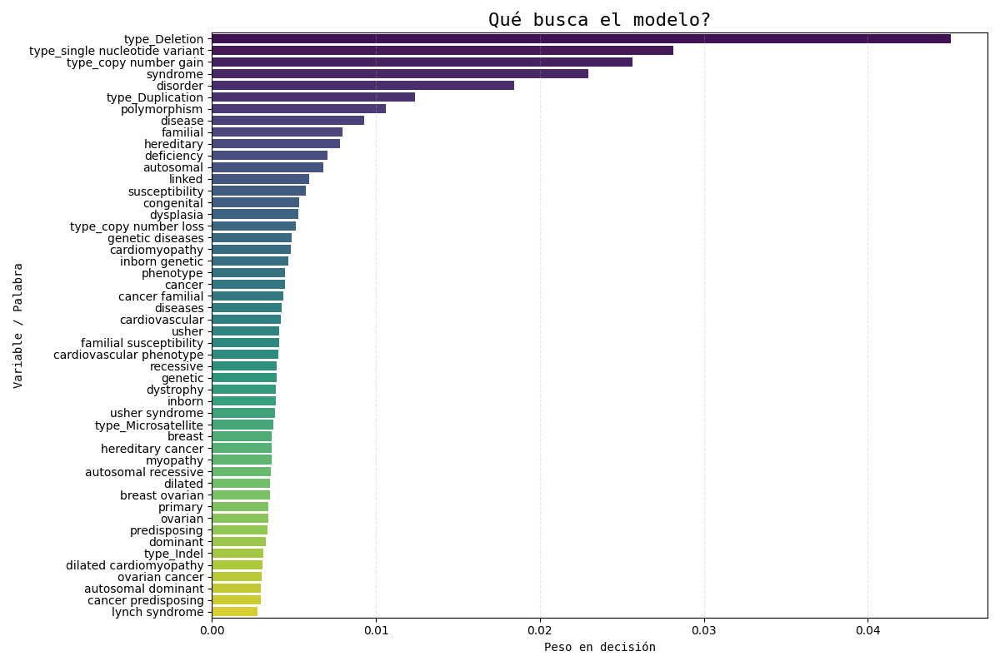

# Proyecto: Predictor de Patogenicidad Clínico

  

Una herramienta bioinformática impulsada por un modelo de aprendizaje autumátioico para clasificar variantes genéticas (SNPs, INDELs) como **Patogénicas**, **Benignas** o de **Significado Incierto** basándose en descripciones clínicas de ClinVar.

## Características Principales

* **Algoritmo:** Combina procesamiento de lenguaje natural (TF-IDF) sobre fenotipos médicos con características estructurales de la mutación.
* **Interfaz:** Dashboard interactivo diseñado en Shiny for Python.
* **Visualización Interactiva:** Gráficos de dispersión (Jitter Boxplot) con Plotly para análisis granular de clústers de variantes.
* **Compatibilidad NCBI:** Carga nativa de archivos `.txt` tabulares exportados directamente de ClinVar.

## Tecnologías

* **Backend:** `scikit-learn` (Random Forest Classifier), `joblib`, `pandas`.
* **NLP:** `TF-IDF Vectorizer` (entrenado con ~200k variantes).
* **Frontend:** `Shiny for Python`.
* **Visualización:** `Plotly`, `Seaborn`, `Matplotlib`.

## Instalación y Uso

1.  **Clonar el repositorio:**
    ```bash
    git clone [https://github.com/leomorgzzz/leo_prediction_model.git](https://github.com/leomorgzzz/leo_prediction_model.git)
    cd leo_pm
    ```

2.  **Instalar dependencias:**
    ```bash
    pip install -r requirements.txt
    ```

3.  **Ejecutar la aplicación:**
    ```bash
    shiny run scripts/app.py
    ```

4.  **Cargar datos:**
    * Sube un archivo `.csv` o `.txt` (tab-delimited) de ClinVar.
    * La app detectará automáticamente columnas similares a `PhenotypeList` y `Type`.

## Auditoría del Modelo

El modelo prioriza características biológicas (como Deleciones) y terminología clínica clave (`Syndrome`, `Polymorphism`) para tomar decisiones, evitando el sobreajuste a palabras irrelevantes.



## Licencia

Este proyecto fue desarrollado con fines educativos y de investigación bioinformática.
